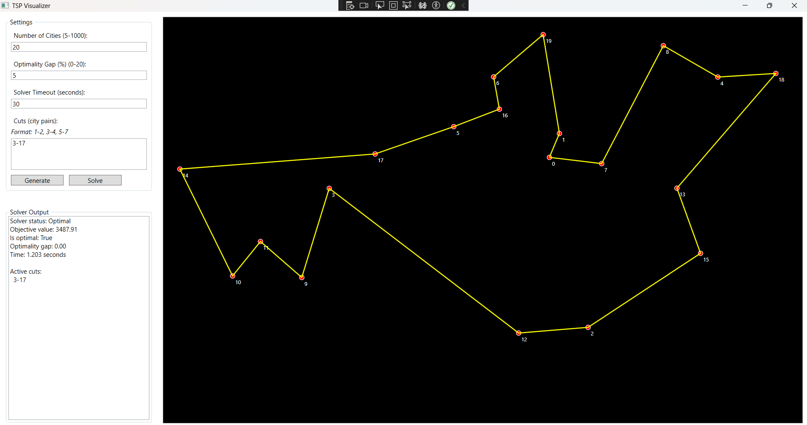

# TSPlayground

A Windows application built with WPF (.NET 8) that visualizes the Traveling Salesman Problem (TSP) and its solutions. 
The application provides an interactive interface for generating random city distributions, solving TSP instances, 
and visualizing the results.



## Features

- Generate random city distributions with customizable number of cities
- Visualize cities and their indices on a canvas
- Solve TSP instances using Google OR-tools
- Display solution paths with optimality information
- Support for adding cuts to eliminate specific city connections
- Real-time visualization of solutions

## Technical Details

### Backend Solver

The application uses Google OR-tools as its backend solver, specifically the CP-SAT solver. The solver is configured with:

- Customizable timeout
- Optimality gap tracking
- Solution status reporting

### TSP Formulation

The TSP is formulated using the following constraints:

1. **Variables**: Binary variables x[i,j] for each pair of cities (i,j) where i ≠ j
   - x[i,j] = 1 if city j is visited immediately after city i
   - x[i,j] = 0 otherwise

2. **Objective**: Minimize the total distance of the tour
   ```
   min ∑(i,j) distance[i,j] * x[i,j]
   ```

3. **Constraints**:
   - Each city must be visited exactly once (in-degree = 1)
   - Each city must be left exactly once (out-degree = 1)
   - Subtour elimination using Miller-Tucker-Zemlin (MTZ) formulation:
     ```
     u[i] - u[j] + n * x[i,j] ≤ n-1
     ```
     where:
     - u[i] is the position of city i in the tour
     - n is the number of cities

### Cuts Functionality

The application supports adding cuts to eliminate specific city connections. This is useful for:

- Forcing the solver to avoid certain paths
- Testing alternative solutions
- Implementing additional constraints

Cuts are specified in the format: "city1-city2, city3-city4, ..."

- Each cut prevents direct travel between the specified city pairs
- Cuts are added as constraints: x[i,j] = 0 and x[j,i] = 0
- The solver will find the optimal solution that respects all cuts

## Usage

1. Enter the number of cities (5-1000) and click "Generate"
2. (Optional) Enter cuts in the format "0-1, 2-3" to prevent specific connections
3. Set the timeout in seconds
4. Click "Solve" to find the optimal tour
5. View the solution path and solver statistics in the output panel
6. Add or remove cuts, then click "Solve" to generate a new solution

## Output Information

The solver provides:

- Solver status (Optimal/Feasible/Infeasible)
- Objective value (total tour distance)
- Optimality status
- Optimality gap
- Solving time
- List of active cuts (if any)

## Requirements

- Windows OS
- .NET 8 Runtime
- Google OR-tools package 
